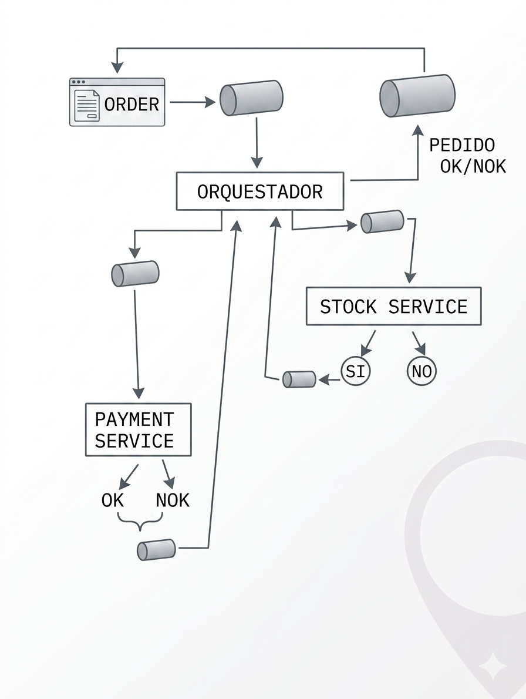

# Patrón Saga con Masstransit
Ejemplo de patrón SAGA en .Net con MassTransit. 
Se basa en los siguientes mircroservicios 


# Diccionario

* Publish = 📢 “anuncio público”
* Send = 📦 “paquete con dirección”
* Saga = 🧠 “director de orquesta”
* Consumers = 👷 “trabajadores”

# Ejecutar

```bash
# rabbitmq
docker run -d --hostname rabbit --name rabbitmq  -p 5672:5672 -p 15672:15672 rabbitmq:3-management

# librerias en todos los microservicios
dotnet add package MassTransit
dotnet add package MassTransit.RabbitMQ

# en la raiz del proyecto, ejecutar 

dotnet run --project Order.Api
dotnet run --project Saga.Orchestrator
dotnet run --project Stock.Service
dotnet run --project Payment.Service
```


